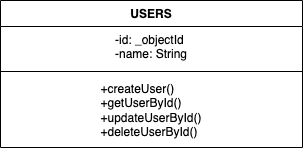

# REST API for Managing Users
This is a simple REST API for performing CRUD operations (CREATE, READ, UPDATE, DELETE) on users. This API is built using Node.js, Express.js, and MongoDB. The instructions for setting up and using the API are as follows

## Table of Contents
- [Prerequisites](#prerequisites)
- [Installation](#installation)
- [API Endpoints](#api_endpoints)
- [Request and Response Formats](#response_formats)
- [ API Sample Usage](#sample_usage)
- [Known Limitations and Assumptions](#known_limitations)
- [UML Diagram](#uml_diagram)

## Prerequisites
Before you begin, ensure you have the following:

- Node.js installed (Download and installation instructions: [Node.js](https://nodejs.org))
- Create Mongo cluster and obtain connection string/URL [MongoDB](https://www.mongodb.com/docs/atlas/getting-started/)

## Installation
1. Clone this repository to your local machine:

```bash
git clone https://github.com/Aivetu/stage2.git
cd stage2
```
2. Install the project dependencies:
```bash
npm install
```

3. Configure the MongoDB connection:

- Create a config folder, and an .env file in your config folder and do the following:
- DATABASE_URI = URL of your mongo database.


4. Start the server:

```bash
npm run start
```
Your API should now be running at http://localhost:8094.

## API Endpoints

### CREATE: Adding a new User
- POST /api/
- Create a new user by sending a JSON payload with the user's name in the request body. Required field: name.

### READ: Fetching details of a user
- GET /api/:id
- Retrieve a user's details by providing their unique identifier in the URL.

### UPDATE: Modifying details of an existing user
- PUT /api/:id
- Update a user's details by providing their unique identifier in the URL and sending a JSON payload with the updated details in the request body.

### DELETE: Removing a user
- DELETE /api/:id
- Delete a user by providing their unique identifier in the URL.

## Request and Response Formats

- Requests and responses are in JSON format.
- Request payloads should follow the format specified in the API documentation.
- Successful responses will have a status code of 200 OK or 201 created.
- Error responses will have appropriate status codes (e.g. 404 Not Found, 500 Internal Server Error) along with an error message in the response body.

## Sample Usage

### CREATE: Adding a new user
- Request:

```bash
POST http://localhost:8094/api
Content-Type: application/json

{
  "name": "Haruna Habibat"
}
```
- Response (201 Created):

```bash
{

  "message": "New User Created",
  "name": "Haruna Habibat",
  "id": "65043ac49aae4750610c8c96"
}
```

### READ: Retrieving details of a user

- Request:
```bash
GET http://localhost:8094/api/65043ac49aae4750610c8c96
```

- Response (200 OK):

```bash
{
  "message": "success",
  "name": "Haruna Habibat"
}
```

### UPDATE: Modifying details of an existing person

- Request:
```bash
PUT http://localhost:8094/api/65043ac49aae4750610c8c96
Content-Type: application/json

{
  "name": "Haruna Habibat"
}
```

- Response (200 OK):

```bash
{
  "Message": "User Details successfully changed",
  "user": {
    "name": "Haruna Habibat",
    "id": "65043ac49aae4750610c8c96"}
}
```

### DELETE: Removing a person

- Request:

```bash
DELETE http://localhost:2000/api/65043ac49aae4750610c8c96

- Response (200 OK):

```
```bash
{
    
    "message": "User deleted successfully"
}
```

## Known Limitations and Assumptions


- The API assumes that the MongoDB database is running locally.
- Authentication and Authorization are not implemented in this API.
- String validation is set up for the request body.


## UML Diagram
